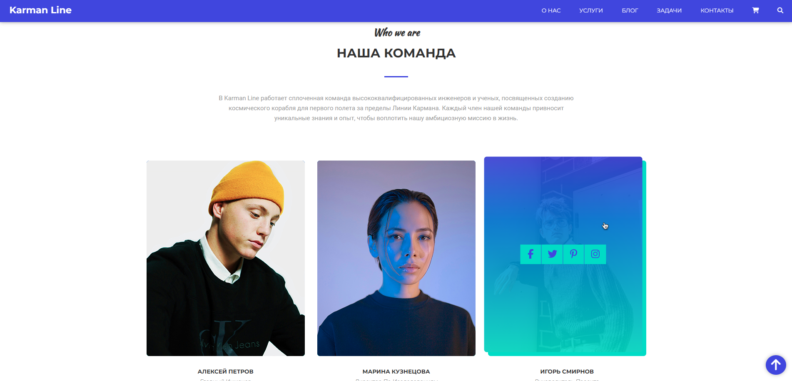

<!-- --------LOGO-------- -->
 

	
	
<strong>Karman Line - наш первый полет в космос</strong>

	<a href="https://ochagovdanil.github.io/karman-line/" target="_blank">Открыть страницу</a>

<!-- --------ABOUT THE PROJECT-------- -->

## О проекте

	

<strong>Karman Line</strong> - использует следующие технологии:

<ul>
	<li>HTML</li>
	<li>CSS</li>
	<li>BEM</li>
	<li>SCSS</li>
	<li>normalize.css</li>
	<li>JQuery</li>
	<li>Swiper JS</li>
	<li>Font Awesome Icons</li>
</ul>

<!-- SET UP INSTRUCTIONS -->

## Инструкция по запуску приложения

Открыть файл `index.html` с помощью вашего любимого браузера.

<!-- --------CONTRIBUTING-------- -->

## Контрибуция

Контрибуция делает сообщество с открытым исходным кодом удивительным местом для обучения, вдохновения и творчества. Любой ваш вклад **высоко ценится.**

Если у вас есть предложение по улучшению, пожалуйста, сделайте fork репозитория и создайте pull request. Вы также можете просто создать issue с меткой "enhancement".
Не забудьте поставить star проекту! Спасибо еще раз!

1. Fork репозиторий
2. Создайте вашу Feature Branch (`git checkout -b feature/AmazingFeature`)
3. Сделайте коммиты с изменениями (`git commit -m 'Add some AmazingFeature'`)
4. Push в ветку (`git push origin feature/AmazingFeature`)
5. Откройте Pull Request

<!-- --------LICENSE-------- -->

## Лицензия

Распространяется по лицензии MIT. Смотрите `LICENSE` для получения дополнительной информации.

<!-- --------CONTACT-------- -->

## Связь со мной

Очагов Данил

Email: danilochagov@gmail.com

Telegram: @danilochagov

VK: https://vk.com/danilochagov

Ссылка на Github проект: [https://github.com/ochagovdanil/karman-line](https://github.com/ochagovdanil/karman-line)
